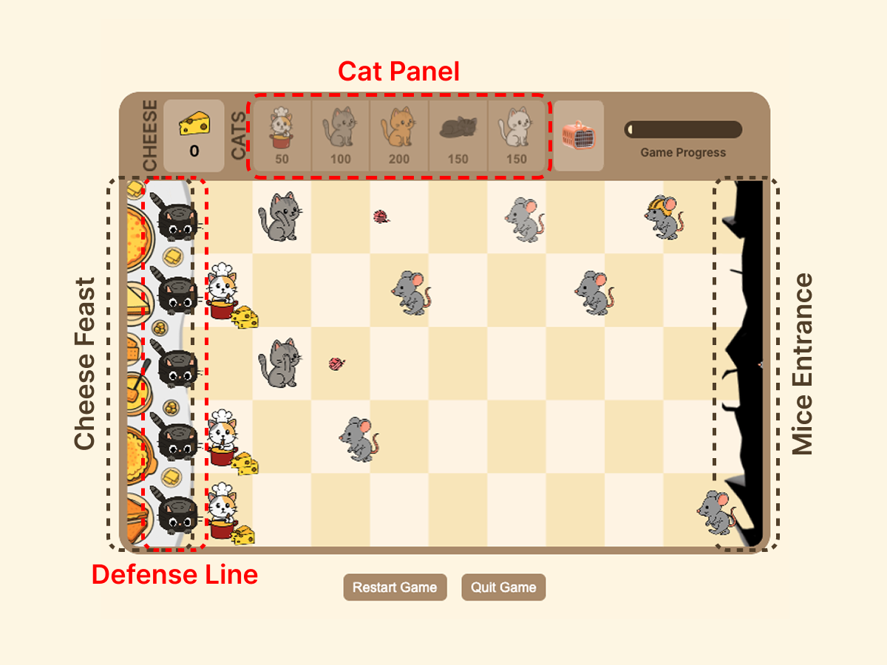
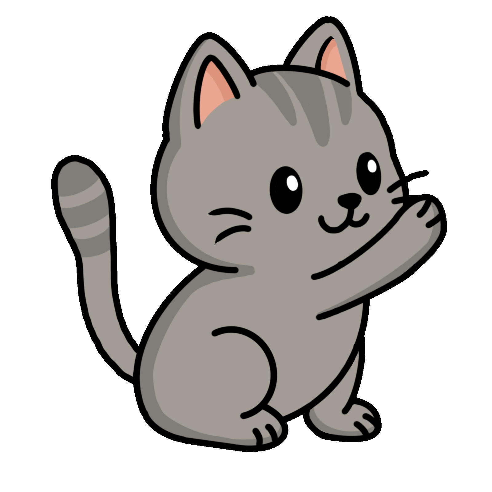
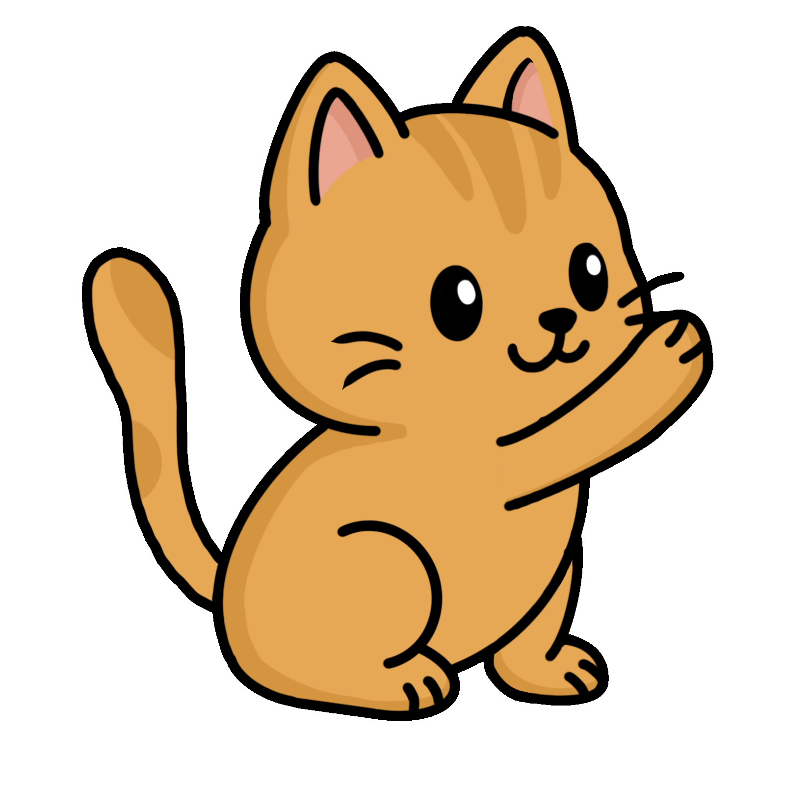
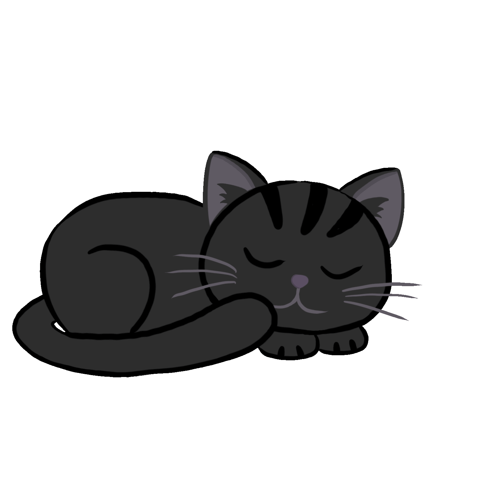
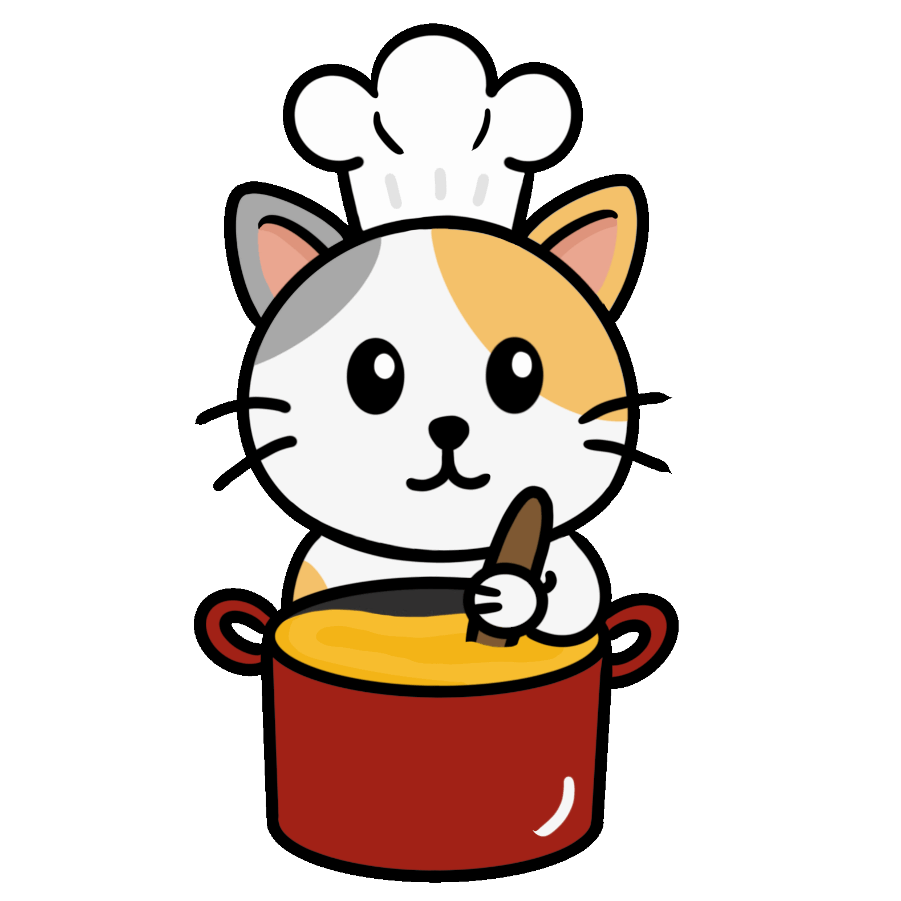
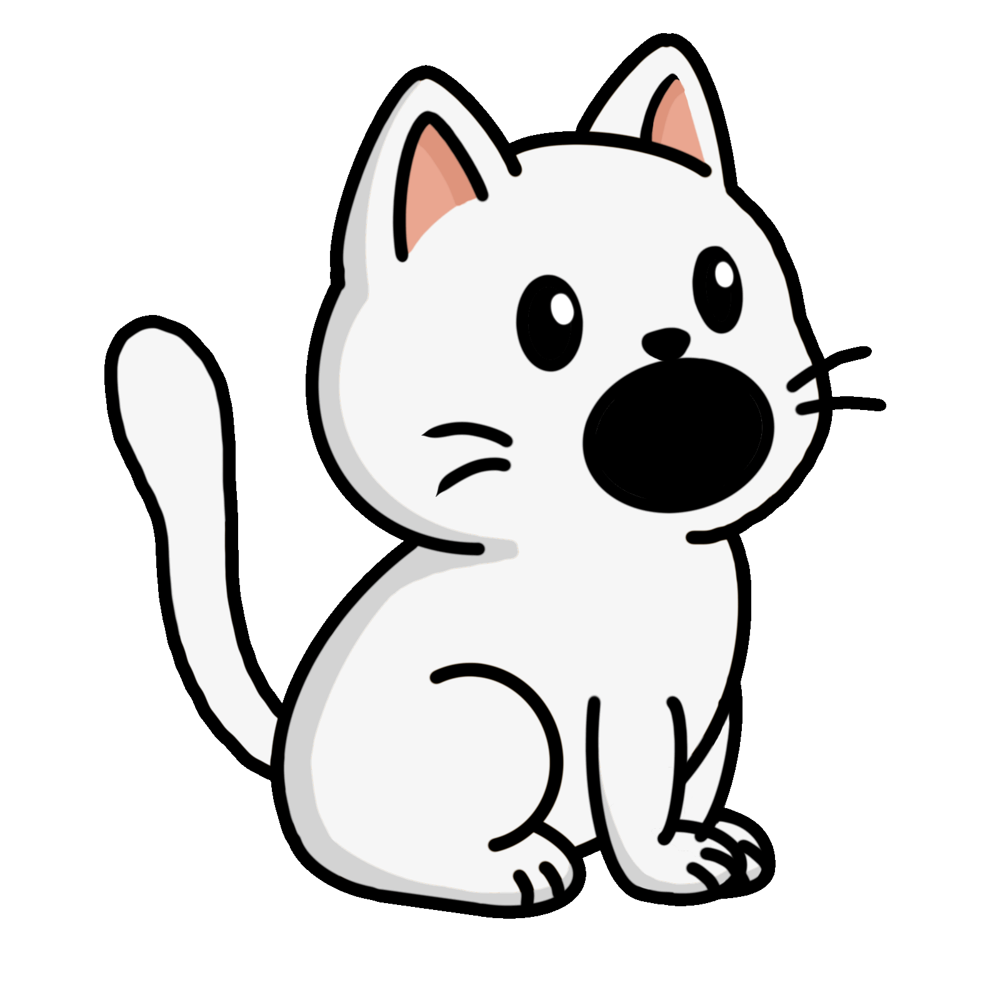
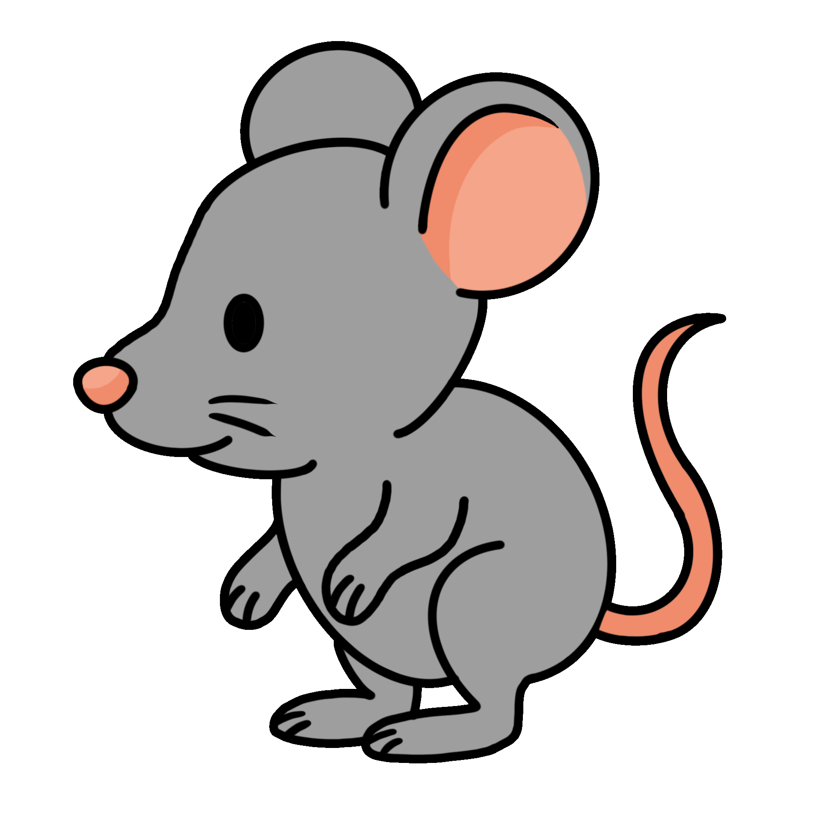
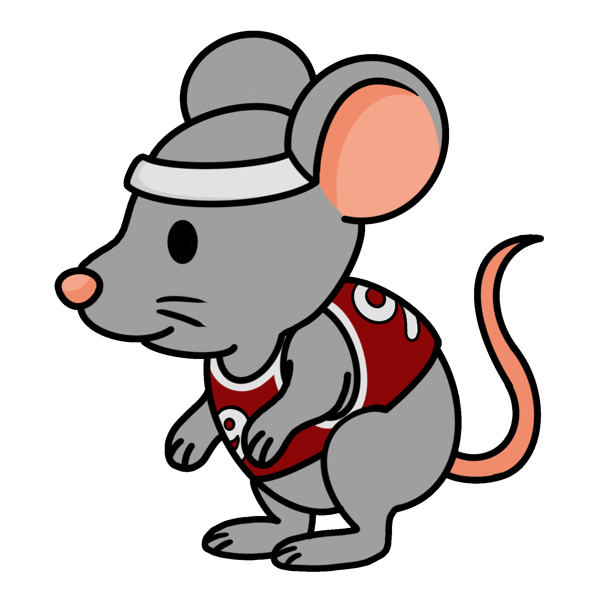
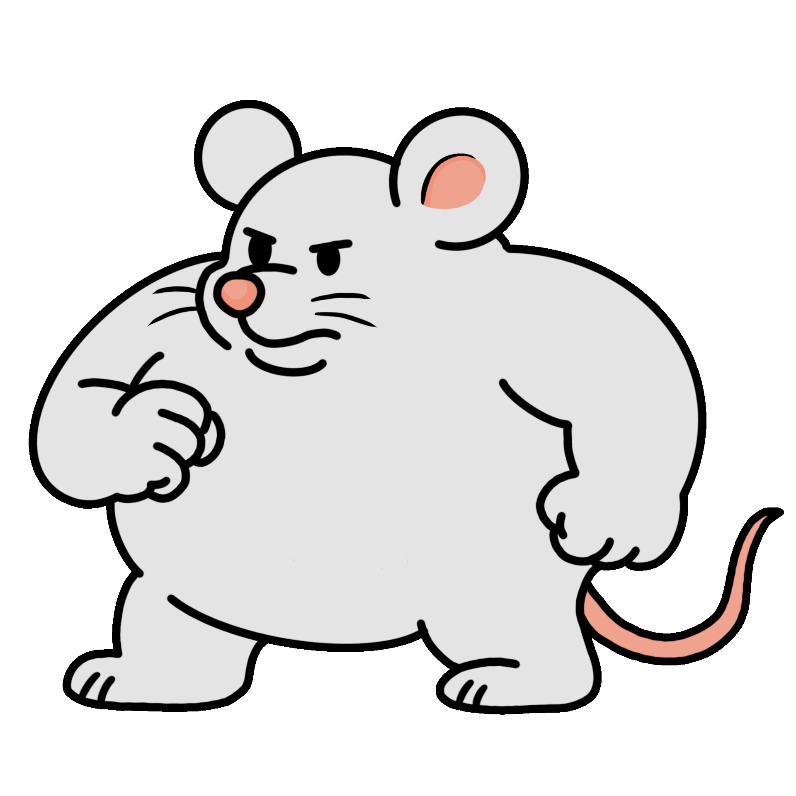
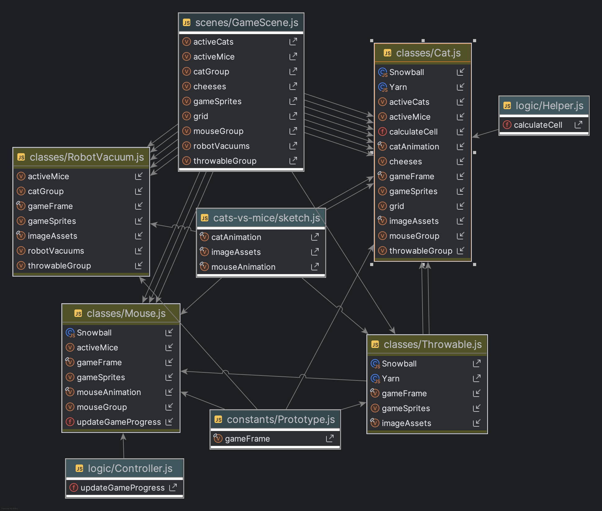

# 🐱 Cats vs. Mice 🐭

## 👤 Student Information
Name        : Adelia Putri  
Student ID  : 20210782  
Email       : adelia@kaist.ac.kr  
Git Repository: [Cats vs. Mice Repository](https://github.com/adeliptr/Cats-vs-Mice)  
Demo Video: [Cats vs. Mice Demo Video](https://youtu.be/wxM7zTX4wvc)

## 📚 Table of Content
- [🐱 Cats vs. Mice 🐭](#-cats-vs-mice-)
  - [👤 Student Information](#-student-information)
  - [📚 Table of Content](#-table-of-content)
  - [🎮 Game Description](#-game-description)
    - [🖼️ Game Interface](#️-game-interface)
  - [🕹️ Game Mechanics](#️-game-mechanics)
    - [💸 Currency](#-currency)
    - [👾 Characters](#-characters)
      - [1. Cats 🐈](#1-cats-)
      - [2. Mice 🐁](#2-mice-)
    - [🔗 Interactions List](#-interactions-list)
  - [🗂️ Code Organization](#️-code-organization)
    - [💻 Tech Stack](#-tech-stack)
    - [🧩 How Components Interact](#-how-components-interact)
    - [💡 Design Patterns Used](#-design-patterns-used)
      - [🏭 Factory Method Pattern](#-factory-method-pattern)
      - [♟️ Strategy Pattern](#️-strategy-pattern)
  - [⭐️ Special Features](#️-special-features)
  - [⚠️ Limitation](#️-limitation)
  - [🙌 Acknowledgement](#-acknowledgement)


## 🎮 Game Description
**Cats vs. Mice** is a tower defense-style strategy game inspired by [*Plants vs. Zombies*](https://en.wikipedia.org/wiki/Plants_vs._Zombies), redesigned with a cute kitchen theme. Players place cats on a tiled kitchen floor to stop waves of invading mice who are after the **Cheese Feast**, a table full of cheesy dishes at the leftmost side of the screen.

> 🎯 **Objective**:  
> The player’s goal is to protect the **Cheese Feast** by defending against waves of incoming mice  
> To do this, the player can place different types of **[cats](#1-cats-)** with special abilities to attack the **[mice](#2-mice-)**

> 🏆 **Winning Condition**:  
> Successfully stops all the mice from reaching the **Cheese Feast**  
> The progress can be seen on the progress bar at the top right of the screen  

> ❌ **Losing Condition**:  
> A mouse reaches the **Cheese Feast**

<p align="center">
    
</p>

### 🖼️ Game Interface
- **Background**: A 5x9 tiled kitchen floor with a checkered pattern
- **Cat Panel**: A row of clickable cat icons showing the price of each cat
- **Cheese Feast**: A table full of cheese dishes on the left side of the screen
- **Mice Entrance**: Mice appear from a hole on the floor on the right side of the screen
- **Defense Line**: Each row has a *robot vacuum* at the far left that activates once a mouse approaches it, sweeping away all mice in that row
- **Cheese** (currency): Drops from `🧑‍🍳 Chef Cat` periodically
- **Progress Bar**: Showing the progress of the game, if the progress bar is full, the player wins the game

## 🕹️ Game Mechanics
### 💸 Currency
   - The currency of the game is `🧀 Cheese` (replacing the sun in *Plants vs. Zombies*)
   - Players can collect cheese produced by `🧑‍🍳 Chef Cat` 
   - `🧀 Cheese` is used to buy different types of **[cats](#1-cats-)**, which can be placed on the 5x9 kitchen grid

### 👾 Characters
#### 1. Cats 🐈
   - Objective: Protect the **Cheese Feast** by attacking the mice, slowing down the mice, or generating cheese. Each cat has a different ability and price
   - Cats can only be placed in empty tiles
   - Cats can be removed from the tiles by using the `Cage Button`
   - Cats' HP is shown through its opacity, the lower the HP, the lower the opacity
   
   **Cat Roles**
   | Icon | Cat Type | Ability | Cheese Cost |
   |------|----------|---------|-------------|
   |    | Single Yarn Cat | Shoots 1 yarn ball every 3 seconds | 100 |
   |  | Double Yarn Cat | Shoots 2 yarn balls every 3 seconds (double damage) | 200 |
   |    | Sleepy Cat | Sleeps until touched, then instantly attacks mouse that touched it | 150 |
   |    | Chef Cat | Produces 25 cheeses every 10 seconds | 50 |
   |    | Ice Cat | Slows down mice by throwing snowballs and attacks them | 150 |

   Notes:
   - `🧶 Yarn` : reduces a mouse's HP by 20 points
   - `❄️ Snowball` : reduces a mouse's HP by 8 points + speed reduction (-0.02 units/frame)

#### 2. Mice 🐁
   - Objective: Mice enter from the right side and move left toward the **Cheese Feast**
   - Mice will move forward in a straight line unless blocked by a cat
   - If a mouse reaches a cat, it will attack the cat, which is indicated by a smoke puff

   **Mouse Roles**

   | Visual |  Mouse Type  | Description | Appearance |
   |------|--------------|-------------|------------|
   |    | Basic Mouse  | Walks slowly (0.15), standard HP (100) | Early Game |
   |    | Helmet Mouse | Wears a helmet, high HP (150) | Mid Game |
   |    | Sporty Mouse | Moves quickly (2x Basic Mouse), low HP (80) | Mid Game |
   |  | Boss Mouse | Very slow (3x Basic Mouse), very high HP (1000) | Late Game |

### 🔗 Interactions List
In the game, players can do the following actions:
| **Action**| **Trigger** | **Result**|
|----------------|-------------|-----------|
| Cheese pick up | Mouse click on cheese icon | Increase cheese count |
| Place cat      | Mouse click on UI + tile | Deduct cheese, place cat |
| Remove cat     | Mouse click on UI + cat | Remove cat from the tile |

In the game, these interactions between entities can happen:
| **Interaction**| **Trigger** | **Result**|
|----------------|-------------|-----------|
| Yarn / Snowball hits mouse | Collision | Mouse takes damage |
| Mouse reaches cat | Collision | Mouse attacks cat |
| Mouse reaches robot vacuum | Collision | Robot vacuum move to the right and remove all mice in the rows |
| Mouse reaches Cheese Feast | Collision | Trigger loss state |
| All mice defeated | Mouse count check | Trigger win state |

## 🗂️ Code Organization

### 💻 Tech Stack
This project is developed using JavaScript, HTML, and CSS for structuring and styling the user interface  

Libraries used in the project:
- `p5.js`: for drawing and managing canvas-based graphics
- `p5.play`: for sprite and animation handling in the game environment
- `p5.scenemanager`: for managing multiple game scenes (start page and actual game page)

### 🧩 How Components Interact
This game is built using `Object-Oriented Programming (OOP)` principles to create reusable code. The overall structure of the code is as follows:

```
├── README.md
├── assets/                   // all game assets
├── css/                      // game styling
├── index.html                // entry point of the game
├── js/                       // external libraries
├── sketch.js                 // main game script
└── src                       // core game source code
    ├── classes               // class definitions for game entities
    │   ├── Cat.js
    │   ├── Mouse.js
    │   ├── RobotVacuum.js    
    ├── constants
    │   ├── Colors.js         // centralized color palette
    │   └── Prototype.js      // dimensions from Figma prototype
    ├── level
    │   ├── Level1.js         // list of mice for level 1
    │   └── WinLose.js        // win/lose overlay
    ├── logic
    │   ├── Controller.js     // UI update functions
    │   └── Helper.js         // general utility functions
    └── scenes                // game scenes for screen manager
        ├── GameScene.js
        └── StartScene.js

```

In this project, `GameScene.js` acts as the central coordinator of the gameplay. Below is the significance of each components:
- **Game Loop** (`GameScene.js`): checks for interactions between entities and calls the appropriate methods
- **Entity Classes** (`src/classes/`): each entity manages its own state and behavior (action(), attack(), etc.), which will be called by `GameScene.js`  
- **UI Sync** (`Controller.js`): updates DOM (cheese count, progress bar, etc.) based on internal game state

The UML for the classes is as follows:
<p align="center">
    
</p>


### 💡 Design Patterns Used
#### 🏭 Factory Method Pattern
- Implemented in the `createCat(type, x, y)` and `createMouse(type, row)` functions
- These functions abstract away the creation logic and allows easy type extension

#### ♟️ Strategy Pattern
- Each `🐱 Cat` subclasses overrides the action() method to implement different attack behaviors (e.g., throwing yarn, exploding)

## ⭐️ Special Features
- **Opacity-based HP indicator**: the cats and mice's opacity lowers as their HP decreases
- **Robot Vacuum**: Activated when a mouse touches it and will defeat all mice in its row upon activation

## ⚠️ Limitation
The current version still has these limitations:
- When a `💤 SleepyCat` overlaps with 2 mice, it only attacks the first mouse that touches it instead of both
- When 2 mice perfectly overlap with each other, one of them won't be detected by other entities like `RobotVacuum`

## 🙌 Acknowledgement
- I learned how to use p5.play from the tutorial at [Learn p5play](https://p5play.org/learn/index.html)
- I found solutions to coding issues on [Stack Overflow](https://stackoverflow.com/questions)
- I referred to [W3Schools CSS Reference](https://www.w3schools.com/cssref/index.php) for styling help
- Some visual assets were sourced from [Flaticon](https://www.w3schools.com/cssref/index.php), [PNGTree](https://pngtree.com/), [LovePik](https://lovepik.com/), [PNGEgg](https://www.pngegg.com/)